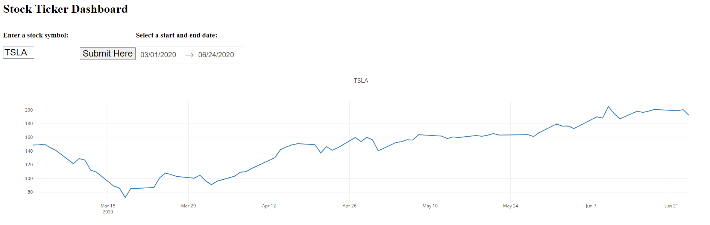

## Charles Neukuckatz's Portfolio

---

### Python Projects 

[Stock Ticker](https://github.com/geraltofrivia69/Python-Repository/blob/master/StockTicker2020v5.py)

### Projects

---
[Google Search Recreation CS50 Web EDX Project 0](/pdf/sample_presentation.pdf)

---
[E-Commerce Site CS50 EDX Project 2](http://example.com/)

---
[Super Smash Brothers Ranking Site CS50 EDX Final Project](http://example.com/)

---

### Category Name 2

- [Project 1 Title](http://example.com/)
- [Project 2 Title](http://example.com/)
- [Project 3 Title](http://example.com/)
- [Project 4 Title](http://example.com/)
- [Project 5 Title](http://example.com/)

---

---

Page template forked from <a href="https://github.com/evanca/quick-portfolio">evanca</a>

<!-- Remove above link if you don't want to attibute -->
